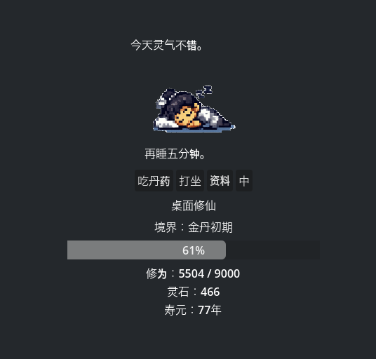

# Tiny Cultivation

🌏 Language

- English (Current)
- [简体中文](README_CN.md)

A tiny desktop cultivation pet inspired by xianxia novels.

## Features

- Auto cultivation
- Realm progression
- Spirit stones
- Random events
- Chinese / English language support
- Desktop companion mode

## Current Realms

- Qi Refining
- Foundation Establishment (Coming Soon)
- Golden Core
- Nascent Soul (Coming Soon)

## Screenshots

## Roadmap

### v0.2
- Luck system
- More random events
- Personality effects

### v0.3
- Equipment system
- Alchemy system
- Tribulation system

### v0.5
- Multiple cultivators
- Sect management

## Built With

- Godot 4.6

## Author

Tee 
